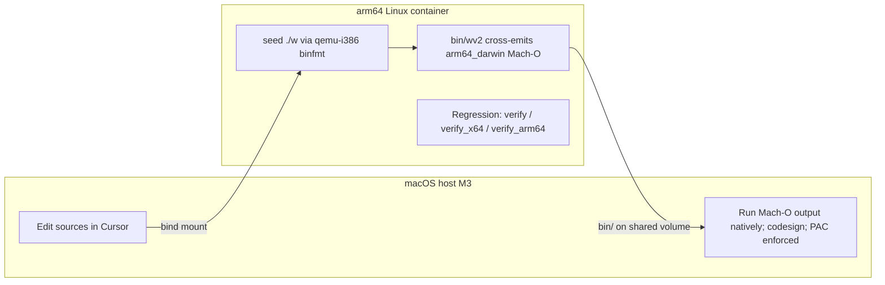

# ARM64 Stages 4–5, Implemented Locally on This Mac

## Context

Stages 1–3 of [docs/projects/arm64.md](arm64.md) are done: `w arm64 file.w` produces a self-hosting AArch64 **Linux ELF** with pac=ret and a W^X text/data split. The later steps are:

- **Stage 4** — Mach-O container + Darwin syscalls + code signing (`arm64_darwin` target)
- **Stage 5** — `--pac=off|ret|full` flag, function-pointer signing, arm64e cpusubtype

This machine is ideal for it: **M3 Pro** (FEAT_PAuth/PAuth2/FPAC) running **macOS 26.3** (arm64e ABI open to third parties since macOS 26). The one twist: the seed compiler `./w` is a 32-bit x86 **Linux** ELF, so the toolchain cannot run natively on macOS. The dev loop is therefore:

## Phase 0 — Local environment (Docker)

Docker Desktop is installed but not running. Set up a persistent dev container:

- Start Docker; register binfmt handlers once per VM boot: `docker run --privileged --rm tonistiigi/binfmt --install 386,amd64` (the `F` flag preloads static qemu, so nothing to install in the dev container for x86 emulation).
- Dev container: `docker run -d --name w-dev -v "$PWD":/w -w /w ubuntu:24.04 sleep infinity`; `apt-get install qemu-user-static file` inside.
- Small wrapper script (e.g. `tools/mac/wdev.sh`) so `./tools/mac/wdev.sh ./wbuild verify` execs into the container.
- Validate the baseline in-container: `mkdir -p bin && ./wbuild build && ./wbuild verify && ./wbuild verify_arm64 && ./wbuild arm64_smoke_test`. Since the container is arm64, try running arm64 test binaries natively (`QEMU_ARM64=` override) — check `grep paca /proc/cpuinfo` first; if the Docker VM doesn't expose PAuth, keep the default `qemu-aarch64-static -cpu max`.
- Skip `dynamic_test`/x64 c_import tests if i386 dynamic libc proves troublesome under emulation; they are not touched by this work (the guards that matter are `verify`, `verify_x64`, `verify_arm64`).

## Phase 1 — Target plumbing: `arm64_darwin`

- Add `target_os` global (0=linux, 1=darwin) next to `target_isa` in [code_generator/code_emitter.w](../../code_generator/code_emitter.w); parse `arm64_darwin` in `link_impl` in [compiler/compiler.w](../../compiler/compiler.w) (sets `target_isa=1`, `word_size=8`, `data_split=1`, `target_os=1`).
- `import_resolve_arch` in [grammar/import_statement.w](../../grammar/import_statement.w): return `arm64_darwin` when `target_os==1` (one axis, four values — per the doc's D4 recommendation).
- `be_start`/`be_finish` in [code_generator/elf.w](../../code_generator/elf.w): dispatch to `macho_start_arm64()`/`macho_finish_arm64()` when `target_os==1`.
- Update `lib/wmeta.w` `__arch__` expansion (currently validates x86+x64 only — add arm64 and arm64_darwin) and `package.wmeta`.
- Seed constraint: all of this is seed-compiled code — no new W syntax allowed. None is needed.

## Phase 2 — Darwin syscall layer

- New `lib/__arch__/arm64_darwin/syscalls.w`: BSD syscall numbers (write=4, exit=1, mmap=197, open=5, ...), keeping the exact wrapper surface of [lib/__arch__/arm64/syscalls.w](../../lib/__arch__/arm64/syscalls.w) so `lib/` and `structures/` compile unmodified. Plus `context.w` and an introspection stub (see Phase 4).
- Darwin syscall stubs in [code_generator/arm64_asm.w](../../code_generator/arm64_asm.w), dispatched on `target_os`: number in **x16**, `svc #0x80`, and convert the carry-flag+positive-errno convention to the -errno contract W expects (`b.cc` skip + `neg x0, x0`).
- No `brk` on Darwin: force `malloc_mmap_mode = 1` at startup (the fallback already exists in [lib/memory.w](../../lib/memory.w)); omit the `brk` wrapper.

## Phase 3 — PIE groundwork (done on the ELF target first)

arm64 macOS main executables are mandatorily PIE; the kernel slides the image and nothing applies relocations. Staged like the Stage-3 W^X split — implement and regression-test on the **arm64 Linux ELF** target where `verify_arm64` + qemu smoke tests already exist:

- Replace the absolute ldr-literal address slots (`be_addr_slot_emit` in [code_generator/arm64.w](../../code_generator/arm64.w)) with `adrp+add` (PC-relative, inherently slide-proof). The backpatch-chain read/write in [compiler/symbol_table.w](../../compiler/symbol_table.w) must reassemble the split immediates — add the `be_addr_slot_read/write` helpers the doc calls for.
- Absolute pointers embedded in **data** (UTF-8 string descriptors in [grammar/string_literal.w](../../grammar/string_literal.w), global array headers in [grammar/program.w](../../grammar/program.w)): emit a compiler-generated **rebase table**; the entry stub computes slide (runtime `adr` result minus linked address) and patches each listed site (~30 lines of startup code, per the doc's D5 recommendation).
- Guard: `verify_arm64` byte-identical fixpoint, `arm64_smoke_test`, and `verify`/`verify_x64` untouched (x86/x64 keep absolute addressing).

## Phase 4 — Mach-O writer + first native run

- New `code_generator/macho_64.w`: MH_EXECUTE + MH_PIE, `__PAGEZERO` (4 GB), `__TEXT` rx, `__DATA` rw, `__LINKEDIT`, `LC_BUILD_VERSION`, **`LC_UNIXTHREAD`** (dyld-less static binary; entry pc + initial sp in arm64 thread state). Image base becomes 0x100000000 — flush out anything assuming the ELF base 0x08048000 (notably [lib/testing.w](../../lib/testing.w) and `lib/__arch__/arm64/elf_introspect.w`; give Darwin a stub introspect module initially).
- Darwin entry stub: `mov x28, sp`, park real sp, argv from the Darwin initial stack layout, apply rebase table, `bl _main`, `exit` via `svc #0x80`. Never touch x18.
- Interim signing: `codesign -s -` on the host (available, verified). Acceptance for this phase: `./bin/wv2 arm64_darwin tests/hello.w -o bin/hello_darwin` in the container, then `codesign -s - bin/hello_darwin && ./bin/hello_darwin` natively on the Mac. Bind-mounted files carry no quarantine xattr, so this just works.

## Phase 5 — In-house ad-hoc signing

- SHA-256 in `lib/` (pure W; also earmarked to replace the FNV rolling hash in [tools/wexec.w](../../tools/wexec.w) later — out of scope here).
- `code_generator/macho_sign.w`: ad-hoc CodeDirectory (SHA-256 per **16 KB** page — `pageSizeLog2 = 14`, matching the arm64 macOS VM page / what `codesign` emits — no certificate) embedded in `__LINKEDIT`; references: ld64 `libcodedirectory.c`, lld D96164. Drop the host `codesign -s -` fallback once `codesign -v` passes on W-signed output.
- Remember the vnode signature-cache gotcha for when the compiler eventually runs on macOS (write-then-rename); harmless for cross-compiles that land as new inodes, but `run_darwin_tests.sh` still copies to a fresh inode before exec.

## Phase 6 — Darwin test target

- `tests_darwin` compile target in [build.json](../../build.json) (in-container: compiles hello + `lib_test` + a smoke subset to `bin/*_darwin`), plus a host-side runner `tools/mac/run_darwin_tests.sh` that executes them natively (Phase 5 self-signs; the runner only does the fresh-inode copy), checking exit codes.
- Stage 4 acceptance per the doc: hello + lib_test subset green on the M3, arm64 slice, PAC inert.

## Phase 7 — Stage 5: PAC to production

- Parse `--pac=off|ret|full` in [compiler/compiler.w](../../compiler/compiler.w) (today `arm64_pac=1` is hardcoded; keep `ret` the default).
- `--pac=full`: sign W function pointers at materialization (IA key, zero discriminator), indirect calls become `blraa x0, xzr` (`call_eax` in [code_generator/x86.w](../../code_generator/x86.w) dispatch); `gen_switch`/`repl_setjmp` in [code_generator/arm64_asm.w](../../code_generator/arm64_asm.w) sign resume addresses with the buffer address as discriminator.
- arm64e: emit `CPU_SUBTYPE_ARM64E` + versioned ABI bits when `arm64_darwin --pac=full`; test enforcement natively on this Mac (macOS 26.3).
- Negative tests: corruption fixtures that must die — under qemu in the container (exit 132) and natively as arm64e on the M3.

## Regression guards (every phase)

`./wbuild verify`, `verify_x64`, `verify_arm64` stay byte-identical in the container; `arm64_smoke_test` green; `parser_generator_w_test` covers any `.w` file additions (no new syntax planned).

## Execution update (2026-07-07): cloud-first split

Phase 0 works but is painfully slow on the Mac: the seed `./w` is a 32-bit x86 Linux ELF, so every compiler stage runs under qemu-i386 emulation inside the arm64 Docker VM (~3 minutes per stage; a full `./wbuild verify` approaches 15). The Cursor Cloud environment is native x86_64 — the seed runs at full speed there and `qemu-aarch64-static` is baked into the snapshot — so all phases that need only Linux move to the cloud:

- **Cloud (native x86):** Phases 1–3 (target plumbing, Darwin syscall layer, PIE groundwork), plus the byte-emission side of Phases 4–5 (Mach-O writer, SHA-256, CodeDirectory). All regression guards (`verify`, `verify_x64`, `verify_arm64`, `arm64_smoke_test`, `parser_generator_w_test`) run there at full speed.
- **This Mac (native arm64/macOS):** acceptance runs only — compile `arm64_darwin` binaries (native `w_darwin` seed, or the `w-dev` container for cross-checks), then run them natively: `codesign -v` on compiler-emitted signatures, Mach-O loading, PAC/arm64e enforcement on the M3, `tools/mac/run_darwin_tests.sh` (Phases 4–7 acceptance criteria).

The `w-dev` container and `tools/mac/wdev.sh` stay as the local harness for that second half.

## Execution update (2026-07-08): macOS 26 killed LC_UNIXTHREAD — Phase 4 went dyld-loaded

The Phase 4 plan above (and D5 in arm64.md) assumed the known-working dyld-less
`LC_UNIXTHREAD` construction. That path is dead on macOS 26.3, established
empirically on this M3 (even Apple's own `ld -static` output dies the same way):
AppleSystemPolicy SIGKILLs at exec any main executable whose mach header lacks
`MH_DYLDLINK` — the log signature is
`ASP: Security policy would not allow process`, with a *valid* ad-hoc signature.
The kernel side never reports a reason to the process (exit 137, and lldb can't
launch it either).

What macho_64.w emits instead — the minimal set macOS 26.3 accepts, found by
bisecting load commands against a working `ld`-linked raw-syscall binary:

- Header flags `MH_NOUNDEFS | MH_DYLDLINK | MH_TWOLEVEL | MH_PIE`.
- `LC_MAIN` (dyld calls the entry as C-ABI `main(argc, argv, envp, apple)`;
  the entry stub pushes x0/x1 onto the W stack instead of reading the kernel
  stack) + `LC_LOAD_DYLINKER /usr/lib/dyld`.
- `LC_UUID` — dyld hard-requires it (`missing LC_UUID load command`); a fixed
  value suffices, uniqueness is not checked.
- `LC_LOAD_DYLIB /usr/lib/libSystem.B.dylib` — dyld refuses a main executable
  with no dylibs (`must link with at least libSystem.dylib`). Nothing is bound
  from it; the runtime stays raw-syscall. dyld maps it from the shared cache
  and runs its initializers before `_main` — harmless.
- Zeroed `LC_SYMTAB` + `LC_DYSYMTAB`: with no chained-fixups/dyld-info
  commands, dyld falls back to classic relocations and walks these; zero
  counts no-op the walk, while *omitting* the commands segfaults dyld inside
  `forEachRebase_Relocations`.
- The nominal-base trick: linked addresses stay 32-bit (`0x08048000` base, as
  on the arm64 ELF target) while the load commands map `__TEXT` at
  `0x100000000`; the entry-stub rebase walk computes slide = runtime − nominal
  and absorbs the difference. Both bases are 16 KB-congruent so `adrp` pairs
  survive the slide.

Also confirmed in practice: the vnode signature-cache gotcha is not
theoretical — an inode once executed-and-killed keeps failing after a valid
re-sign. `tools/mac/run_darwin_tests.sh` therefore copies each binary to a
fresh inode before exec, and compile targets should prefer new output files
over truncating previously-executed ones.

Phase 7's arm64e slice needs re-testing under this policy regime when it
lands (done — see the 2026-07-09 Phase 7 update below).

### Native-compiler blocker found: 32-bit pointer tables vs the mandatory 4 GB __PAGEZERO

Running the *compiler itself* natively (`wv2 arm64_darwin w.w -o bin/w_darwin`,
signed, on the M3) starts and then segfaults in `str_from_cstr` via
`import_alias_register`: the crash address is the low 32 bits of an mmap'd
pointer. Root cause: many compiler-internal tables store pointers as 32-bit
values at 4-byte stride (`save_int(table + i * 4, cast(int, ptr))` — 32+ sites:
`grammar/import_statement.w` alias/plain tables, `grammar/generic.w`,
`compiler/type_table.w` packed name fields, `grammar/defer.w`, ...). Every
existing target keeps the W heap below 4 GB (fixed ELF base + brk; win64
deliberately stays non-LARGE_ADDRESS_AWARE), so the truncation is lossless
there. On arm64 macOS it cannot be: the kernel refuses a main executable
whose `__PAGEZERO` is smaller than 4 GB (verified empirically — SIGKILL at
exec, same as ld64's `-pagezero_size` floor), so *every* Darwin mmap result
is ≥ 4 GB and the truncated pointers are garbage.

Consequence: W *programs* that keep pointers in full words run fine natively
(hello, testing_ground pass), but the compiler needed its pointer tables
widened to host-word slots before it could self-host on macOS.

**Resolved the same day**: `save_ptr`/`load_ptr` (`__word_size__`-sized) in
integer.w, and every pointer-holding table converted — import tables,
generic def/inst/forward records and reparse-save blocks, type-table
records (uniform word slots), dwarf `debug_files`/`debug_local_names` (and
the debugger's readers), and the hash-table string-key descriptor
accesses. On a 32-bit host `__word_size__` is 4, so seed-compiled layouts
are unchanged; `verify`/`verify_x64` stayed byte-identical.

With that, **native Darwin self-hosting works**: the compiler cross-built
as `arm64_darwin`, signed ad-hoc, compiles `w.w` natively on the M3 in
~4.4 s, its output is byte-identical to the Linux cross-compile of the
same sources (cross-host determinism), and the natively-built compiler
reproduces itself (self-host fixpoint on macOS). Note for the future
native dev loop: `__word_size__` is a *target* constant, so any use of it
in compiler sources is fixpoint-safe, but it lands in emitted code — never
run the guards against a source tree being edited concurrently (the
container build re-reads bind-mounted sources between stages).

## Execution update (2026-07-09): dynamic linking + native graphics landed

The graphics/macOS project (plan in docs/projects/graphics.md, "The
macOS backend") closed the dynamic-linking gap this plan deferred:

- **AAPCS64 FFI shims** (`code_generator/ffi.w`): x0-x7/v0-v7
  classification, Linux 8-byte stack spill, C frame parked below the W
  stack (x28 adopts sp at entry, so a naive push would corrupt the
  oldest W words). Validated natively on aarch64 (dynamic_test,
  float_abi_test) and on the M3.
- **aarch64 ELF dynamic linking** (`elf_dynamic.w`): interp
  /lib/ld-linux-aarch64.so.1, R_AARCH64_GLOB_DAT/COPY, reserved phdr
  slots 2/3 (slot 1 is the W^X data load); GOT slots move to the RW
  data segment on data_split targets.
- **Mach-O binds** (`code_generator/macho_dynamic.w`): classic
  LC_DYLD_INFO_ONLY opcodes — probed first: macOS 26.3 dyld still
  accepts them for main executables across an ad-hoc re-sign, so no
  chained fixups. Load commands append into the (now 1024-byte)
  headerpad; the bind stream is __LINKEDIT's payload; the entry rebase
  stub and dyld binds touch disjoint cells by construction.
- **extern alias** (`= "symbol"`): one library symbol bound once per
  call signature — what objc_msgSend needs.
- **Result**: graphics/demo.w runs as a native arm64 Mach-O app in a
  real Mac window (AppKit + NSOpenGL 3.2-core via objc_msgSend, GL
  "4.1 Metal"); the gl smoke test passes its glReadPixels checks
  natively.

## Execution update (2026-07-09): Phase 7 / Stage 5 landed

Implemented natively on the M3 (the darwin seed toolchain made the
container loop unnecessary). What matched the plan: `--pac=off|ret|full`
with `ret` default, paciza-at-materialization + `blraaz` in `call_eax`,
buffer-address discriminators in `repl_setjmp`/`repl_longjmp`, arm64e
cpusubtype under `arm64_darwin --pac=full`, corruption fixtures asserted
dead on both qemu and the M3. What shifted (details in arm64.md's "D6
execution notes"):

- `--pac` needed a pre-scan before `be_start` (whole-program level; the
  Mach-O header consumes it), not a positional flag-loop entry.
- `sym_get_value` is NOT the only materialization point: the print, json
  and generic chain-slot call targets each needed `be_code_ptr_sign()`
  after their chain bookkeeping — found the hard way when every print
  faulted at its first authenticated call.
- `gen_switch` signs resume addresses with zero discriminator (not the
  buffer address) so `__w_gen_create`'s seeded entry address — signed at
  materialization — authenticates under the same convention and
  lib/generator.w needs no target-specific code.
- arm64e header bits calibrated against clang on macOS 26: `0x81000002`
  (versioned ABI, ptrauth version 1). AppleSystemPolicy accepts the ad-hoc
  signed arm64e slice; the pac=full compiler self-hosts natively as arm64e
  with byte-identical output.
- macOS reports the PAC faults as SIGSEGV/SIGBUS (exit 139/138) where qemu
  reports SIGILL (132); `tools/mac/run_darwin_tests.sh` grew a must-die
  list asserting death-by-signal instead of exact codes.

New tests: `pac_flag_test` (byte-pattern artifact assertions via
`tools/pac_flag_check.w`; default `tests` aggregate), `pac_full_test_arm64`
and `pac_corrupt_test_arm64` (qemu, outside the `tests` umbrella), `pac_darwin`
(compile-only arm64e guard; run natively via `run_darwin_tests.sh`).

## Execution update (2026-07-09): Phase 5 in-house signing

Compiler-emitted ad-hoc signatures land in `lib/sha256.w` +
`code_generator/macho_sign.w`, wired from `macho_finish_arm64`. Page size
is **16 KB** (`pageSizeLog2 = 14`), not the 4 KB the early plan text
assumed — matching arm64 macOS VM pages and what host `codesign` emits.
`tools/mac/run_darwin_tests.sh` no longer calls `codesign -s -`; it only
copies to a fresh inode before exec.

`update_darwin` has promoted a self-signing `w_darwin` seed;
`build_darwin` / `wexec_darwin` / `wbuild`'s Darwin bootstrap no longer
call host `codesign` — only a fresh-inode copy before exec remains.
