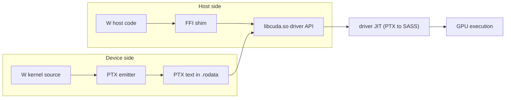

# CUDA Backend for W

Brainstorm for adding NVIDIA GPU support to the W compiler. Companion to the x64
work: every viable path below assumes a 64-bit host process, because `libcuda.so`
and the CUDA driver API are 64-bit only. Finishing x64 self-hosting (see
`docs/mvp.txt`) is effectively Stage 0 of this project.

**Status: Stages 0–3 are done.** The host side went straight to H1 (real
dynamic linking, both x86 and x64): `c_lib "libcuda.so.1"` + `extern`
declarations link the driver API directly (`grammar/extern_statement.w`,
`code_generator/elf_dynamic.w`, `code_generator/ffi.w`), and `./wbuild cuda_smoke`
runs a hand-written PTX vector add on a real GPU (`tests/cuda_smoke.w`). The
H3 sidecar was skipped. Stage 2 shipped as option A1 (`code_generator/ptx.w`:
`kernel` declarations, the thread-index intrinsics, `launch`) and Stage 3 as
M2 (`gpu for` outlining with capture-as-parameters), both on the M1+M2
surface with the `lib/cuda.w` runtime (managed memory, async launches,
`gpu_sync()`). See "Execution notes (Stages 2–3)" below for the model as
built. docs/projects/torch.md builds on this: its Stage 1 added the
`gpu_atomic_add`/`gpu_atomic_add_int` reduction intrinsics (PTX
`red.add` via `ptx_red_add_*`) and a non-fatal `gpu_available()`
driver+device probe to `lib/cuda.w`, and its Stages 2-3 the
`lib/tensor.w` managed-memory tensor type with CPU fallbacks.
Remaining here: Stage 4 quality (A2 virtual registers, shared memory,
explicit memory API, `gpu float*` types, lazy binding so a missing
libcuda.so.1 degrades instead of failing at load) and the "someday"
list.

## Context: what W is today

- Single-pass, syntax-directed code generator (cc500 heritage). There is no AST or
  IR — grammar rules in `grammar/*.w` emit machine bytes immediately via
  `code_generator/x86.w` (x64 = same module + REX prefix via `emit_x64_opcode()`).
- Output is a static ELF executable by default (`code_generator/elf_32.w` /
  `elf_64.w`) with a single load segment. Programs that declare `c_lib` /
  `extern` or use `c_import` instead get PT_INTERP/PT_DYNAMIC records, eager
  GOT relocations and per-arch C ABI shims, so they can call shared libraries
  such as libc and libcuda directly.
- Target selection is a CLI flag (`w x64 file.w` sets `word_size = 8` in
  `compiler/compiler.w`); a `cuda` flag can follow the same pattern.
- `docs/projects/hiring.txt` already lists `gpu` / `GPUAssembly` knowledge and
  GPU work as a secondary project; `docs/parallel.txt` sketches `thread` / `lock`
  primitives that a GPU model should stay consistent with.

A CUDA backend is really two projects:

1. **Device side** — compile (some subset of) W to code the GPU can run.
2. **Host side** — make the generated W executable talk to the NVIDIA driver to
   load kernels, move memory, and launch.



## The CUDA compilation stack (what we can target)

NVIDIA's own trajectory (`nvcc`): CUDA C++ -> PTX -> SASS. The layers, from most
to least portable:

- **CUDA C++** — source language, compiled by `nvcc` (offline) or NVRTC (a library
  that compiles CUDA C++ source strings at runtime, no `nvcc` needed, but requires
  toolkit libraries `libnvrtc.so`).
- **NVVM IR** — an LLVM IR dialect; `libnvvm.so` compiles it to PTX. Requires the
  toolkit compiler SDK. This is the layer Julia's CUDA.jl and (via LLVM's NVPTX
  backend) OpenAI Triton sit on.
- **PTX** — NVIDIA's *documented, stable, virtual* ISA. Plain text. Currently PTX
  ISA 9.3 (CUDA Toolkit 13.3, mid-2026). The driver JIT-compiles PTX to native
  code at module-load time (`cuModuleLoadData` accepts PTX text directly), so
  emitting PTX requires **only `libcuda.so`** on the user's machine — no toolkit.
- **SASS / cubin** — the real per-architecture machine code. Undocumented and
  unstable across GPU generations; NVIDIA publishes only per-arch instruction
  lists (Turing, Ampere/Ada, Hopper, Blackwell) in the binary-utilities docs.
  Community assemblers exist (MaxAs, TuringAs, CuAssembler) but each covers a
  narrow architecture window.

## Device-side options

### Option A: Emit PTX text directly (recommended)

Treat PTX exactly the way the compiler treats x86 today: a new emitter module
(`code_generator/ptx.w`) with small emit helpers, driven by the grammar. Instead
of `emit(1, "\x50")` it appends text lines ("`add.s32 %r3, %r1, %r2;`") using the
existing string builder (`structures/string.w`).

- Pro: matches W's philosophy — no LLVM, no toolkit dependency, self-contained.
  Documented spec (PTX ISA reference). Driver JIT handles PTX -> SASS forever
  forward-compatibly. Precedent: pyptx (Python), oxicuda-ptx (Rust) both emit PTX
  text without LLVM.
- Pro: PTX is much friendlier than x86 bytes — text format, unlimited virtual
  registers (`%r1, %r2, ...`), typed instructions, no encoding tables.
- Con: PTX is a load/store register machine, not a stack machine. The single-pass
  "everything through `%eax`, spill via `push`" pattern from `x86.w` maps awkwardly.
  Two sub-options:
  - **A1 — stack-machine PTX**: mechanically mirror the x86 pattern using a
    `.local` array as the evaluation stack and one accumulator register. Trivially
    reuses grammar code; produces slow PTX, but the driver JIT's optimizer will
    clean up some of it. Good enough for an MVP.
  - **A2 — virtual-register PTX**: have grammar rules return a register name
    (string/int) instead of leaving values in `%eax`. This is a real change to the
    codegen contract (`promote()`, `push_eax()` call sites), but PTX's infinite
    registers make it *easier* than a register allocator for x86 — just bump a
    counter. Could later feed a real x64 register allocator too.
- Con: no libc/syscalls on device — kernels are pure compute over pointers, which
  is fine; the W device subset simply excludes I/O, `new`, and string helpers at
  first.

### Option B: Emit CUDA C source, compile via NVRTC or nvcc

The transpiler route: pretty-print the kernel body as CUDA C, compile it either
offline (build step invoking `nvcc`) or at runtime (link against `libnvrtc.so`).

- Pro: by far the fastest path to a working demo, and NVIDIA's compiler does all
  optimization. Great as a *reference oracle* to validate our PTX emitter output.
- Con: requires the CUDA Toolkit on the user machine (NVRTC is not part of the
  driver), and it abandons W's "we emit the bits ourselves" ethos. W also has no
  way to call `libnvrtc.so` today, so it inherits the same FFI problem as the
  driver API anyway.

### Option C: Emit NVVM IR via libNVVM

Emit LLVM-dialect IR text and let `libnvvm.so` produce PTX.

- Pro: optimization passes for free; the "grown-up" path (Triton/CUDA.jl-style).
- Con: heaviest dependency (toolkit compiler SDK + libdevice), and we'd be
  emitting an IR whose spec tracks LLVM versions. If we're going to emit textual
  IR anyway, PTX itself is simpler and more stable. Not worth it unless W later
  wants LLVM-grade optimization.

### Option D: Emit SASS/cubin directly

The "self-hosted all the way down" fantasy: assemble native GPU machine code like
we assemble x86 bytes.

- Pro: no JIT at load time, total control, maximally in-character for W.
- Con: undocumented, changes per architecture, no official assembler contract,
  community assemblers cover single generations. A research project, not a
  backend. Keep as a long-term curiosity (fits the `GPUAssembly` line in
  `hiring.txt`), possibly by studying `cuobjdump -sass` output of our own PTX.

**Recommendation: A (A1 first, A2 as follow-up), with B used manually as a
validation oracle during development.**

## Host-side options (the harder problem)

The generated executable must call the CUDA **driver API**: `cuInit`,
`cuDeviceGet`, `cuCtxCreate`, `cuModuleLoadData` (accepts PTX text),
`cuModuleGetFunction`, `cuMemAlloc` / `cuMemcpyHtoD` / `cuMemcpyDtoH`,
`cuLaunchKernel`. Driver API (not runtime API `cudaMalloc`/`cudaLaunch`) because
it lives in `libcuda.so`, ships with the driver, and is designed exactly for
"language emits PTX, loads it at runtime".

W's static-ELF, syscall-only runtime cannot call any shared library today. Four
ways in:

### H1: Real dynamic linking in the ELF writer — implemented

Extend `elf_64.w` to emit `PT_INTERP` (ld-linux), `PT_DYNAMIC`, `.dynsym`,
`.dynstr`, PLT/GOT relocations against `libcuda.so`.

- Pro: the "correct" solution, and it unlocks the `c_import` item already on
  `docs/todo.txt` (calling any C library). Biggest long-term payoff.
- Con: biggest lift — dynamic section plumbing, relocation types, symbol
  versioning quirks, plus x64 System V calling convention shims (W's internal
  convention is stack-based; libcuda expects args in rdi/rsi/rdx/rcx/r8/r9).

**This is what shipped, on both targets.** Design notes: eager binding (one
GOT slot per import + one `GLOB_DAT` relocation, no lazy PLT), a generated
per-import shim that converts W's stack convention to the C ABI (System V
registers on x64, re-pushed cdecl args on x86, both 16-byte aligned), and
`DT_HASH`/`.dynsym`/`.dynstr`/`.dynamic` appended to the single load segment
at finish time. Symbol versioning quirk to know about: libcuda's `_v2` ABI
revisions (e.g. `cuCtxCreate_v2`, `cuMemAlloc_v2`) must be named explicitly
in `extern`, since the CUDA headers normally hide that renaming.

### H2: Hand-rolled dlopen in W

Keep the static ELF; at startup, W runtime code opens `libcuda.so`, parses its
dynamic symbol table, mmaps segments, applies relocations — a mini dynamic
linker written in W (we already parse/emit ELF, so the format knowledge exists
in-house).

- Pro: no ELF-writer changes; deeply educational; stays fully static.
- Con: libcuda.so has its own dependencies (libc, libdl, libpthread, librt) and
  expects TLS, ifuncs, and libc runtime state. Realistically we'd be
  reimplementing ld.so. High risk of a tarpit. A middle path: `dlopen` via a
  *host* libc — but that again requires H1-style linking against libdl.

### H3: Sidecar GPU server process

Ship (or generate once) a tiny helper binary — written in C, ~200 lines, linked
against libcuda normally — that speaks a simple protocol over a pipe or Unix
socket: "load this PTX", "alloc N bytes", "copy", "launch f with these args".
The W executable fork/execs it and talks via syscalls it already has.

- Pro: zero changes to W's linking model; W stays pure-syscall; debuggable with
  strace; the protocol doubles as a device abstraction for future backends
  (WebGPU?). Precedent: this is essentially how some sandboxed runtimes reach
  the GPU.
- Con: introduces a compiled-C artifact into a self-hosted project (bootstrap
  smell); per-call IPC latency (fine for coarse kernels, bad for chatty code);
  shared memory (`memfd` + `mmap`) needed to avoid copying buffers through pipes.

### H4: ioctl the kernel driver directly

Skip libcuda entirely and speak to `/dev/nvidia*` via ioctls — the syscall-only
dream.

- Con: the NVIDIA ioctl interface is undocumented, unstable, and enormous
  (libcuda exists precisely to hide it). The open-gpu-kernel-modules source makes
  it *visible* but not *stable*. Even nouveau-based stacks go through Mesa. Not
  viable; listed for completeness.

**Recommendation: H3 to bootstrap (get kernels running with zero linker work),
then H1 as the real investment — it pays for `c_import` and every future C
library, not just CUDA.**

## Programming model options (what W code looks like)

### M1: Explicit kernels, CUDA-style

```
kernel add(float* a, float* b, float* c, int n):
	int i = block_idx() * block_dim() + thread_idx()
	if i < n:
		c[i] = a[i] + b[i]

launch add[blocks, threads](a, b, c, n)
```

Thread-level model, maps 1:1 onto PTX special registers (`%tid.x`, `%ctaid.x`,
`%ntid.x`). Most transparent; most footguns (sizing, bounds masks by hand).

### M2: Parallel-for on existing range loops (best MVP)

W already has `for int i in range(...)`. Add one keyword:

```
gpu for int i in range(n):
	c[i] = a[i] + b[i]
```

The compiler outlines the loop body into a PTX kernel (captured variables become
kernel parameters), auto-generates the guard `if (i < n)`, picks a block size,
and emits host code for launch. This is the smallest surface area that delivers
real value, and it composes with the planned `thread`/`lock` design in
`docs/parallel.txt` (same mental model: annotate a loop, runtime does the rest).

### M3: Triton-style tile programs

Triton's insight (Tillet et al., MAPL 2019; Triton 3.7 today): don't expose
threads at all. A "program" instance owns a *tile*; `tl.load`/`tl.store` on
ranges with masks; the compiler (Triton IR -> TritonGPU MLIR -> LLVM -> PTX)
handles vectorization, shared memory, and layouts. The pipeline is heavy MLIR
machinery, but the *language surface* is the steal-worthy part:

```
gpu[1024] for tile in range(n):        # each program handles 1024 elements
	c[tile] = a[tile] + b[tile]        # loads/stores auto-masked
```

W could adopt tile semantics without the optimizing stack — lower a tile op to a
simple per-thread loop first, and treat Triton-grade codegen (coalescing, shared
memory staging) as future optimization work inside the same syntax.

**Recommendation: M2 first, with syntax designed so M3 tile semantics can layer
on later. M1's builtins fall out for free (the outlined kernel needs them
internally anyway) and can be exposed for power users.**

## Memory model

- **Explicit** (`cuMemAlloc` + `cuMemcpyHtoD/DtoH`): most control, most
  ceremony; host and device pointers are different types (a `gpu float*`
  qualifier would let the type table catch cross-domain bugs).
- **Unified/managed** (`cuMemAllocManaged`): one pointer valid on both sides,
  driver migrates pages on demand. Dramatically simplifies the MVP — `new` on a
  managed heap and `gpu for` just works, no copy calls. Costs performance on
  first touch.

Recommendation: managed memory for the MVP (`gpu new float[n]` or making the
GPU allocator a compile-flag choice), explicit copies as the later
performance-oriented API.

## Suggested staged path

- **Stage 0 — x64 completion** (done): 64-bit self-hosting, `lib_test` on x64,
  working 64-bit pointers/stack.
- **Stage 1 — host plumbing spike** (done, via H1 directly): hand-written
  vector-add PTX as a string literal in `tests/cuda_smoke.w`, loaded with
  `cuModuleLoadData` and launched with `cuLaunchKernel` through `c_lib` /
  `extern`. Acceptance met: `./wbuild cuda_smoke` runs vector add on a real GPU
  (RTX 4080).
- **Stage 2 — PTX emitter** (done): `code_generator/ptx.w` with A1
  stack-machine emission for kernel bodies (int/pointer/float32/float64
  arithmetic, if/while/switch, nested for-range). Kernel PTX is embedded in
  the host image behind a synthesized `char* __w_ptx_module()` and passed to
  `cuModuleLoadData` at runtime; `--ptx=<path>` dumps it for inspection and
  the GPU-less `gpu_ptx_emit_test` asserts on the text.
- **Stage 3 — `gpu for` (M2)** (done): outlining pass (`grammar/gpu_for.w`),
  parameter capture, guard insertion, launch-config heuristic (256-thread
  blocks) and managed-memory allocation (`gpu_alloc`). Acceptance:
  `./wbuild cuda_test` — `gpu for` vector add + `kernel`/`launch` saxpy,
  verified against CPU results (reduction/atomics moved to Stage 4).
- **Stage 4 — quality**: A2 virtual-register emission, explicit memory API,
  `gpu float*` types, error handling for `CUresult` codes, multi-GPU device
  selection.
- **Someday**: tile semantics (M3), shared-memory staging, `cuBLAS` interop via
  `c_import` (host-callable GEMM without writing kernels), SASS study
  (`cuobjdump -sass` on our PTX; CuAssembler experiments), fatbin embedding of
  pre-JIT'd cubins alongside PTX.

## Execution notes (Stages 2–3, as built)

- **Mixed-mode emission.** There is no `cuda` CLI target: a program is host
  x64 code with device bodies. `kernel` bodies and `gpu for` bodies compile
  with `target_isa == 3`, routing every emit helper in
  `code_generator/x86.w`/`sse.w` to a `ptx_*` twin in `code_generator/ptx.w`
  that appends PTX **text** to a module buffer instead of bytes to `code`.
  Host and device instruction streams never interleave, so the single-pass
  model needs no backpatching across the boundary.
- **A1 register model.** `%ax/%bx/%cx` (.b64) mirror eax/ebx/scratch,
  `%fa/%fb`/`%da/%db` mirror xmm0/xmm1 at each float width, `%w0` stages
  32-bit transfers, `%p` holds compare results. The W evaluation stack is a
  4 KB `.local` array converted once with `cvta.local.u64`, so `%sp`/`%bp`
  hold generic addresses and every load/store — stack, parameter or user
  pointer — is a plain generic `ld`/`st` (`&local` keeps working; no
  `cvta.to.global` needed). W `int` is `.s64`, pointers `.u64`, and the
  module header is `.version 6.0 / .target sm_52 / .address_size 64`.
- **Parameters as locals.** Every kernel parameter is `.param .u64 p0..pN`
  (one 8-byte cell each; float32 rides as raw bits, the host convention).
  The prologue `ld.param`s each into the accumulator and pushes it,
  declaring the name as an ordinary `'L'` local, so the existing addressing
  machinery is unchanged.
- **`gpu for` capture layout.** Captures live at fixed offsets below `%bp`
  (capture k at `[%bp - (k+1)*8]`, slot 0 = the range bound, 32 slots
  reserved), so a capture discovered mid-body never invalidates addresses
  already emitted — that is what makes single-pass outlining work. Captured
  scalars are device-local copies: writes do not propagate back (a Stage 4
  diagnostic candidate). Pointers must be device-accessible (`gpu_alloc`).
- **Async launches.** `launch` and `gpu for` enqueue and return;
  `gpu_sync()` (cuCtxSynchronize) is the synchronization point. The host
  must not touch managed buffers while a kernel using them is in flight.
  This is deliberate: W has no async constructs yet, and the explicit sync
  point should later align with the `thread`/`lock` design
  (`docs/parallel.txt`).
- **Device subset.** No function calls, globals, strings, `new`/containers,
  limb/bit intrinsics, `raw_asm`, `defer`, `?`, `yield`, or `return` inside
  `gpu for` (bare `return` is fine in `kernel` bodies). Bounds checks are
  silently off in device code (the trap path calls host runtime helpers);
  float compares are ordered (NaN → false), the wasm divergence model.
  Diagnostics are frozen by `cuda_diagnostics_test`.
- **Testing without a GPU.** `gpu_ptx_emit_test` (in the default umbrella)
  prints/greps the embedded module; `cuda_test` (opt-in, like `cuda_smoke`)
  runs vector add + saxpy on real hardware. The host launch plumbing
  (module text, kernel name, grid/block, kernelParams layout) was verified
  GPU-less against a logging stub libcuda during development.

## Open questions

- CI on machines without an NVIDIA GPU: `./wbuild cuda_smoke` needs a driver and a
  GPU, so it stays out of the default `./wbuild tests` for now. Does Stage 3 need
  a CPU fallback (run the outlined loop body on CPU when `cuInit` fails) so
  `cuda_test` can join the default suite?
- ~~H3 sidecar vs going straight to H1 dynamic linking~~ — resolved: went
  straight to H1; no compiled-C helper in the repo.
- Float support: W's type table today is integer/pointer-centric; kernels
  without `float`/SSE support on the host side are of limited use. Does float
  land as part of x64 work or as part of this project? (`cuda_smoke` sidesteps
  this by storing IEEE-754 bit patterns in integer memory.)
- Which GPU generation is the floor? PTX target directive (e.g.
  `.target sm_70`) affects available instructions. (`cuda_smoke` uses
  `.target sm_52`, which the driver JIT accepts on newer parts.)

## References

- PTX ISA reference (v9.3): https://docs.nvidia.com/cuda/parallel-thread-execution/
- CUDA compiler driver (nvcc) docs: https://docs.nvidia.com/cuda/cuda-compiler-driver-nvcc/
- CUDA Driver API — module loading (`cuModuleLoadData`, accepts PTX text):
  https://docs.nvidia.com/cuda/cuda-driver-api/group__CUDA__MODULE.html
- CUDA Driver API — execution (`cuLaunchKernel`):
  https://docs.nvidia.com/cuda/cuda-driver-api/group__CUDA__EXEC.html
- Driver vs Runtime API: https://docs.nvidia.com/cuda/cuda-runtime-api/driver-vs-runtime-api.html
- NVRTC (runtime CUDA C++ compilation): https://docs.nvidia.com/cuda/nvrtc/
- libNVVM / NVVM IR spec: https://docs.nvidia.com/cuda/libnvvm-api/ ,
  https://docs.nvidia.com/cuda/nvvm-ir-spec/
- PTX Compiler API (PTX->cubin without module load):
  https://docs.nvidia.com/cuda/ptx-compiler-api/
- CUDA binary utilities / per-arch SASS instruction lists:
  https://docs.nvidia.com/cuda/cuda-binary-utilities/
- Triton repo and docs: https://github.com/triton-lang/triton ,
  https://triton-lang.org/main/index.html
- Triton paper (Tillet, Kung, Cox — MAPL 2019):
  https://eecs.harvard.edu/~htk/publication/2019-mapl-tillet-kung-cox.pdf
- Triton compilation stages writeup:
  https://pytorch.org/blog/triton-kernel-compilation-stages/
- Direct-PTX emitters without LLVM: https://github.com/patrick-toulme/pyptx ,
  https://crates.io/crates/oxicuda-ptx
- SASS assemblers (research): https://github.com/NervanaSystems/maxas ,
  https://github.com/daadaada/turingas , https://github.com/cloudcores/CuAssembler
- Device-side CUDA C++ abstractions for comparison: CUB
  (https://nvidia.github.io/cccl/unstable/cub/index.html), Cooperative Groups
  (https://docs.nvidia.com/cuda/cuda-programming-guide/04-special-topics/cooperative-groups.html)
- Host-callable libraries for later interop: cuBLAS
  (https://docs.nvidia.com/cuda/cublas/), cuDNN
  (https://docs.nvidia.com/deeplearning/cudnn/latest/)
- Contrast: LLVM-based GPU language backends — gpucc
  (https://doi.org/10.1145/2854038.2854041), Julia CUDA.jl
  (https://cuda.juliagpu.org/stable/development/kernel/)
