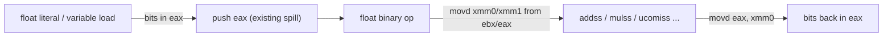

# Floating Point Support (float32 / float64 / float16)

Current status and design notes for IEEE-754 floating point in W. Companion to
the GPU work: the type names and kind helpers chosen here map 1:1 onto PTX
`.f32`/`.f64`/`.f16` for the planned
`code_generator/ptx.w` (see `docs/projects/cuda.md`, Stage 2, and its open
question "Float support: W's type table today is integer/pointer-centric").

**Status: float32/float64 implemented and covered by `./wbuild tests`, including
TestFloat-derived edge-case conformance vectors (NaN propagation, signed
zeros, subnormal arithmetic, infinities, rounding at precision boundaries,
exact-comparison semantics, int<->float conversion edges) in
`tests/float_conformance_test.w` (float32, x86 + x64) and
`tests/x64_float64_conformance_test.w` (float64, x64-only); float16
storage/conversion is also implemented (x86 family only: the default 32-bit
target and x64) and covered by `tests/float16_test.w`. bfloat16 remains
deferred. See "Known MVP semantic differences" below for every divergence
from strict IEEE-754 this conformance pass confirmed.**

Implemented today:

- `float`/`float32` arithmetic, comparisons, unary minus, int<->float
  conversions, params/returns, fields and pointers on the default 32-bit target.
- `float64` literals, arithmetic, comparisons, conversions, params/returns and
  formatting on the x64 target.
- x64 float32 narrowing from a float64 literal.
- `float16` as a declarable, storage-only 2-byte type on the x86 family
  (default 32-bit target and x64; gated on `target_isa == 0`): variable,
  struct-field, and array storage; load widens to float32 (F16C
  `vcvtph2ps`, zero-extended so bit patterns above 0x7FFF survive) and
  store narrows from float32 (F16C `vcvtps2ph`, round-to-nearest-even);
  all arithmetic/comparisons happen on the widened float32 value. Verified
  by `tests/float16_test.w`: exact round-trips (including max normal
  65504.0 and smallest normal 2^-14), round-to-nearest-even on
  non-representable and exact-tie values, overflow to infinity, subnormals,
  signed zero, +-inf, quiet-NaN bit preservation, struct fields, array
  elements, int<->float16 conversion, and comparisons/unary minus. `float16`
  raises a clean compile error ("`<target>`: float16 is not implemented") on
  arm64 and wasm (`code_generator/sse.w`) — not yet ported to those targets.
- Decimal literals with exponent forms and exact-bit regression tests.
- Differential checks against a C reference program for float32 and float64.
- `ftoa` and x64 `f64toa` formatting helpers.
- Floating-point ABI for imported C functions (`extern` and `c_import`):
  xmm argument/return registers on x64, x87 `st(0)` returns on x86, and
  float32→float64 promotion for variadic calls (`printf("%f", x)`). See
  `code_generator/ffi.w` and `float_abi_test` / `varargs_test`.

Still deferred:

- `float16` on arm64 and wasm targets (compile error today).
- `bfloat16` (likely tied to the GPU/PTX track).
- x64 debugger float display, since `wdbg` is still x86-only.

The milestone sections below are the implementation history/design record. Treat
the status bullets above and `float_test`, `float_reference_test`,
`x64_float_test`, `float16_test`, `float_conformance_test`
(`float_conformance_64_test` on x64), and `x64_float64_conformance_test`
as the current support contract.

## Scope

- **float32 and float64** as full arithmetic types; **float16 as an
  implemented storage-only type** (2-byte load/store, all math in float32)
  on the x86 family — the default 32-bit target and x64. bfloat16 is
  deferred to the GPU/PTX backend.
- **float64 is x64-only**: on the 32-bit target it is a clean compile error
  (one-word stack slots cannot hold 8 bytes). float32 works on both targets;
  float16 also works on both (it needs no 8-byte slot) but is a clean
  compile error on arm64 and wasm, where the F16C conversion opcodes have
  no port yet.
- **Exact literals**: decimal literals parse to full target precision with
  integer-only bignum arithmetic (no float detour, no double rounding on the
  32-bit target) and support exponent syntax (`1e5`, `1.5e-3`, `2E+10`).
- **Library float formatting**: `ftoa` and x64 `f64toa` helpers exist. Debugger
  float decoding remains future work (`wdbg` is x86-only today, so float64
  decoding also waits for the x64 wdbg port).

## Core design: float bits ride the existing integer pipeline

The compiler is a single-pass stack machine where `eax` holds every value and
spills go through `push` (`grammar/promote.w`, `grammar/binary_op.w`). Rather
than introduce XMM-centric evaluation (the big refactor `docs/projects/cuda.md`
calls Option A2), float values travel as raw IEEE-754 bit patterns in
`eax`/`rax` and on the stack. XMM registers are used only *inside* each
operation:

This keeps `push_eax`/`pop_ebx`, stack slots, the all-on-stack calling
convention, and `eax` returns completely unchanged. Float function args,
returns, struct fields, and `float*` indexing work with no ABI changes. Unary
minus is a sign-bit flip on the integer bits (`xor eax, 0x80000000` for
float32, `btc rax, 63` for float64).

## Bootstrap constraint (shapes several milestones)

The compiler's own sources are compiled by the old seed binary `./w`, which
has no float support — so nothing in the compiler's import graph (`w.w` ->
`compiler.compiler` -> `codegen` + `grammar` + `lib.lib` + ...) may use float
syntax or float math. Literal parsing therefore uses integer-only arithmetic,
and the compiler always runs as a **32-bit process** (`./bin/wv2` is 32-bit
even when targeting x64 with the `x64` flag), so `int` is 4 bytes inside the
compiler regardless of target. Test files, the debugger, and lib modules not
imported by `w.w` are compiled by the freshly built `wv2`, so they may freely
use the new float features (`lib.format` is only imported by its own test, so
`ftoa` can live there or in a new `lib/float_format.w`).

## Milestone 1 — Type table (`compiler/type_table.w`)

- In `push_basic_types()`: register `float32` (size 4), `float64` (size 8),
  `float16` (size 2), and `float` (size 4, an alias of float32 by kind); add
  `float*`/`float32*` to the common pre-registered pointer types.
- Register two **value pseudo-types** (like the existing `constant`=3 /
  `function`=4 convention where `eax` already holds the value, size 0): one
  for "float32 value in eax", one for "float64 value in rax". Give them names
  containing a space (e.g. `"float32 value"`) so no source token can ever
  look them up via `type_lookup`.
- Record all the new indices in globals (`float32_type`, `float64_type`,
  `float16_type`, `float_type`, `float32_value_type`, `float64_value_type`)
  set during registration; add `type_is_float(t)` / `type_is_float64(t)`
  helpers that compare indices. Pointer types get their own indices, so
  `float*` correctly reads as a non-float scalar (pointer) everywhere.
- `types_compatible()` likely needs **no change**: scalars (pointer level 0,
  no fields) already inter-convert silently, which covers float ↔ int and
  the size-0 pseudo-types, and float ↔ pointer already warns via the
  pointer-level check. Verify with the warning fixtures instead of editing.
  One consequence of the alias-by-kind approach: `float*` vs `float32*` have
  different base names, so mixing them warns (documented limitation).
- Do **not** fix the pre-existing `word_size` shadowing note near
  `push_basic_types` (unrelated; float sizes are hardcoded 4/8/2).

## Milestone 2 — SSE encoder (new `code_generator/sse.w`)

New module imported from `codegen.w`, same hardcoded-byte style as `x86.w`
(fixed registers, no general ModRM encoder). All operations are reg-reg, so
no memory forms. Needed encodings:

- Transfers: `movd xmm0, eax` (`66 0F 6E C0`), `movd xmm0, ebx`,
  `movd xmm1, eax`, `movd eax, xmm0`; x64: `movq xmm0/xmm1, rax/rbx`,
  `movq rax, xmm0` (same bytes with a REX.W prefix).
- Arithmetic: `addss/subss/mulss/divss xmm0, xmm1`
  (`F3 0F 58/5C/59/5E C1`); `sd` variants with `F2` prefix (x64 only).
- Compare: `ucomiss xmm0, xmm1` (`0F 2E C1`), `ucomisd` (`66 0F 2E C1`).
- Conversions: `cvtsi2ss/sd xmm, r32` (both the eax and ebx source forms —
  mixed int/float operands need to convert whichever side is the integer),
  `cvttss2si`/`cvttsd2si eax, xmm0`, `cvtss2sd`, `cvtsd2ss`.
- float16 conversions (F16C, VEX-encoded fixed-byte sequences):
  `vcvtph2ps xmm0, xmm0` (`C4 E2 79 13 C0`) and
  `vcvtps2ph xmm0, xmm0, 4` (`C4 E3 79 1D C0 04`, round-to-nearest); plus a
  `movzx eax, word [eax]`-style 16-bit **zero-extend** load helper — the
  existing size-2 load path (`promote_int16_eax`) sign-extends, which would
  corrupt half bit patterns above 0x7FFF.
- Sign flip: `xor eax, imm32` helper in `x86.w` for float32;
  `btc rax, 63` (`48 0F BA F8 3F`) for float64.
- 64-bit literal immediate: `mov rax, imm64` **taking the immediate as two
  32-bit halves** (`48 B8` + `emit_int32(lo)` + `emit_int32(hi)`). The
  existing `mov_rax_int64(int v)` cannot carry float64 bit patterns because
  the compiler is a 32-bit process: its `int` is 4 bytes and `emit_int64`
  sign-extends the low word.

No new store helper is needed: `grammar/expression.w` sizes stores from the
left-hand side's declared type and any size other than 1/2/4 falls through to
`store_ebx_word()`, which already emits the REX.W 8-byte store on x64 — and
float64 is x64-only, so size-8 stores only ever happen there. Hardware note:
float16 requires an F16C-capable CPU (Ivy Bridge/Zen or newer, 2012+); SSE2
is implied by x86-64 and universal on 32-bit-capable hardware this project
targets.

## Milestone 3 — Tokenizer: float literal tokens with exponents

`compiler/tokenizer.w` `get_token()` changes, guarded by the token
**starting with a digit** (so `import grammar.promote` and `pt.x` stay
untouched; identifiers cannot start with digits):

- If `nextc == '.'` after the alnum scan, consume the dot and rescan alnum,
  producing one token like `3.25` (the existing loop already merges trailing
  letters/digits, so `1e5` is one token today, and `3.25e7` merges fully).
- If the token now ends in `e`/`E`, does **not** start with `0x` (hex guard:
  `0xe+1` must stay three tokens), and `nextc` is `+` or `-`, consume the
  sign and the following digits — this completes `1.5e-3` and `1e-5` into
  single tokens.

Result: `3.25`, `1e5`, `1.5e-3`, `2E+10` each arrive at the grammar as one
token. Safety check done: every digit-followed-by-dot sequence in the current
tree sits inside comments or string literals, which the tokenizer scans
separately, so no existing source re-tokenizes differently. `.5`-style
literals (no leading digit) are not supported.

## Milestone 4 — Exact literal parsing (integer-only bignum)

The compiler is compiled by the float-less seed binary and runs as a 32-bit
process, so literal parsing must use **32-bit integer math only**. Exact
decimal-to-binary conversion needs wide arithmetic, so:

- New `compiler/bignum.w`: a small fixed-width big integer on **16-bit limbs
  stored in ints** (limb × 10 + carry never overflows 32-bit signed math;
  ~80 limbs covers the 10^±308 float64 range). Operations: multiply-by-10
  with carry, shift left/right, compare, subtract — enough for
  shift-and-subtract long division. Unit-tested like
  `compiler/type_table_test.w`.
- New `grammar/float_literal.w`, called from `primary_expr()` **before**
  `int_literal()` when the token contains `.` or is a digit-leading `e` form
  (it must intercept first: `int_literal`'s digit loop would fold the `.`
  character into the value). AlgorithmM-style conversion — mantissa digits
  into a bignum, apply the decimal exponent as bignum ×10^k or a bignum
  denominator, binary-scale until the quotient lands in the target mantissa
  range, extract mantissa bits with round-to-nearest-even from the
  remainder. Parameterized by mantissa width/bias so the same code produces
  **exact float32 (24-bit)** and **exact float64 (53-bit)** patterns;
  float64 bits come out as two 32-bit halves, emitted via the new
  two-halves `mov rax, imm64` helper.
- Literal type follows the target, like C's double-by-default: on x64,
  literals are **float64** returning the float64-value pseudo-type; on the
  32-bit target they are **float32** parsed directly to exact float32 bits
  (no float64 detour, no double rounding). Narrowing/widening to the
  variable's declared type happens at the coerce sites (Milestone 6), e.g.
  `float x = 1.5` on x64 emits `cvtsd2ss`.
- The literal itself is unsigned; `-1.5` reaches the float path through
  unary minus (Milestone 5), whose float dispatch flips the sign bit —
  `neg_eax` (two's complement) would corrupt float bits.

## Milestone 5 — Expression codegen dispatch

- `promote()` in `grammar/promote.w`: early-return for the two float value
  pseudo-types (like types 3/4). Loads of float32/float64 variables already
  work via the size-based paths (float64 uses the existing REX.W word load,
  x64 only; on x64 the size-4 load sign-extends via `movsxd`, which is
  harmless because every float32 consumer reads only the low 32 bits).
  **float16 gets a special load path, dispatched by type index before the
  size-based paths** (the size-2 path sign-extends): 16-bit zero-extend,
  then `vcvtph2ps`, yielding a float32 value in `eax` — after the load it
  behaves exactly like float32 everywhere ("storage-only").
- Restructure the operator sites so the right operand's type is known before
  choosing opcode bytes (today `binary2_finish_pop()` returns 3
  unconditionally), then dispatch on `type_is_float(left) |
  type_is_float(right)`:
  - `grammar/additive_expr.w`, `grammar/multiplicative_expr.w`: float path
    pops into `ebx` (left operand; note integer `/` and `%` currently use the
    self-popping `binary2_finish` path, so the float restructure changes
    that), moves left to `xmm0` and right to `xmm1` (converting an int side
    with `cvtsi2ss/sd` first), emits `addss/subss/mulss/divss`, moves result
    bits back to `eax`, returns the float value pseudo-type. Operand order
    matters for sub/div: `subss xmm0, xmm1` computes left − right. `%` on
    floats is a compile error.
  - `grammar/relational_expr.w`, `grammar/equality_expr.w`:
    `ucomiss/ucomisd` + `seta/setae/sete/setne` (unsigned condition codes,
    because ucomis sets flags like an unsigned compare; operand order
    swapped for `<`/`<=`); result is int 0/1, type 3. NaN semantics
    simplified for the MVP (ucomis reports unordered as ZF=1, so
    `nan == nan` is true; noted in a code comment).
  - `grammar/unary_expression.w`: unary `-` on a float value = sign-bit
    flip; unary `+` unchanged; `!`/`!!`/conditions keep the integer
    `test eax, eax` (bit-pattern truthiness; `-0.0` is truthy — documented
    quirk).
- **Call sites must propagate float return types** (`grammar/postfix_expr.w`
  currently types every call result as 3/constant, which would make
  `coerce()` treat float bits returned from a call as an integer): when the
  callee symbol is known, read its declared return type from the symbol
  table (the same `table + sym + 6` slot the return-statement check uses)
  and return the float value pseudo-type for float-returning callees. Calls
  through untyped function pointers still yield 3 — a documented limitation.
- float64 gate: when a `float64` variable/field/param is declared and
  `word_size == 4`, `error("float64 requires the x64 target")` — at
  `type_name()`/declaration time.

## Milestone 6 — Conversions at store sites

Add a helper `coerce(want_type, got_type)` that emits `cvtsi2ss/sd`
(int→float), `cvttss2si`/`cvttsd2si` (float→int), `cvtss2sd`/`cvtsd2ss`
(width change), or `vcvtps2ph` (float16 narrowing; the existing size-2
16-bit store then writes the half) when the sides differ. Type 3 (constant)
is treated as **int** — that is what makes `float x = 3` convert; it is also
why Milestone 5 must type float-returning calls with the pseudo-type instead
of 3. `coerce` only touches `eax`/xmm scratch, so it can run before or after
the `pop_ebx` at each site. Call it from:

- assignment in `grammar/expression.w` (before the store-width selection;
  the existing width selection already handles size 8 via
  `store_ebx_word()` on x64),
- variable declaration initializers (`grammar/variable_declaration.w`),
- `return` in `grammar/statement.w` (the declared return type is already
  loaded there for the mismatch warning),
- `new_store_field()` constructor args (`grammar/unary_expression.w`) and
  call arguments in `grammar/postfix_expr.w` (declared param types are
  already available via `sym_param_type` for the warning path).

For implemented widths, this makes `float x = 3`, `int n = f`, and `x + 2` do
the right thing; the analogous `float16 h = 1.5` path (narrowing at the
`coerce()` call sites above via `vcvtps2ph`) is implemented too and covered
by `tests/float16_test.w`, on the x86 family.

## Milestone 7 — Debugger float formatting + `ftoa`

The bits-in-`eax` design means float values live in ordinary registers and
stack slots — no XMM state to dump. The debugger just needs to *decode*
words on request:

- `lib/format.w` (or a new `lib/float_format.w`): `ftoa(float f)` /
  `f64toa` producing decimal strings via repeated ×10 digit extraction, plus
  `inf`/`nan` cases. These run in programs compiled by the new `wv2`, so
  they can freely use float arithmetic (see Bootstrap constraint;
  `lib.format` is not in the compiler's import graph).
- `debugger/debugger.w`: extend `wdbg_print_registers` / `wdbg_print_stack`
  output with a float32 decoding column (hex bits stay primary), or add an
  `f` command that re-prints the 16 stack words decoded as float32. Covered
  by `debug_test`'s expected-output check. `wdbg` is x86-only today
  (`docs/todo.txt` limitations), so float64 decoding is deferred to the
  x64 wdbg port.

## Milestone 8 — Tests and library

- `lib/assert.w`: add an `assert_float_equal(int want_bits, float got)`-style
  helper (bit compare) plus an epsilon variant built on the new float ops.
- `compiler/bignum_test.w`: limb ops, ×10 carry chains, long-division edge
  cases.
- `tests/float_test.w` (32-bit, `lib.testing` style): literals including
  **exact-bit-pattern checks** (e.g. `0.1` → `0x3DCCCCCD`) and exponent
  forms (`1e5`, `1.5e-3`, `2E+10`), `+ - * /`, comparisons, unary minus,
  int↔float conversion, float params/returns (both directions through the
  call-site return-type propagation), float struct fields, `float*`
  indexing.
- `tests/float16_test.w` (`# wbuild: x64` twin, `lib.testing` style, x86
  family only): float16 store/load round-trips with golden bit patterns
  (1.0, -2.5, 0.5, max normal 65504.0, smallest normal 2^-14),
  round-to-nearest-even on non-representable and exact-tie values,
  overflow to infinity, subnormals, signed zero, +-inf, quiet-NaN bit
  preservation, struct fields, array elements, int<->float16 conversion,
  and comparisons/unary minus. Landed as its own file rather than inside
  `float_test.w` as originally sketched here.
- Compile-only error fixture for "float64 requires the x64 target"
  (pattern: `warning_test` in `build.json`).
- `tests/x64_float_test.w`: float64 smoke test in the style of
  `tests/x64_test.w` (exit code / printed output), including exact float64
  literal bits (e.g. `0.1` → `0x3FB999999999999A` checked as two 32-bit
  halves), since `lib.testing`'s ELF-symtab discovery hardcoded the 32-bit
  base address and did not work on the x64 backend at the time this
  milestone landed. **Stale as of the issue #17 conformance pass**:
  `lib.testing` discovery was rewritten to be compiler-synthesized rather
  than binary introspection (`compiler/test_registry.w`, issue #147,
  landed alongside the wasm backend work) and now works identically on
  x64 — `tests/float16_test.w`'s `# wbuild: x64` twin and
  `tests/float_conformance_test.w` both use plain `lib.testing` on x64
  today. The plain-`main()` + `expect_stdout` style is kept for
  `x64_float_test.w`/`x64_fmath64_test.w`/`x64_map_float64_test.w` for
  continuity with their existing hand-written `build.base.json` targets,
  not because it is still required; float64-only new tests may use
  either style (see `tests/x64_float64_conformance_test.w` for a
  `lib.testing`-based example with a hand-written base target, since
  float64 has no 32-bit twin to generate from a `# wbuild: x64`
  directive).
- build.json: `float_test`, `bignum_test`, `x64_float_test` targets, added to
  the `tests:` umbrella.

## Milestone 9 — Verify, docs, commit

- `./wbuild build verify tests` — the self-host fixpoint (`wv3 == wv4 == wv5`)
  must still hold since the compiler source itself uses no float syntax
  (bignum is pure integer code); all existing tests plus the new float
  targets green. Fix and re-run until clean. `./wbuild verify_x64` must also
  stay green (it is part of `tests` via `tests_x64`).
- Docs bookkeeping per repo convention: update the `float` line in
  `docs/todo.txt`, add an entry to `docs/done.txt`, note the float64/x64
  restriction and the F16C hardware requirement for float16.
- Land in logical commits (type table, SSE encoder, tokenizer+bignum+
  literals, dispatch, conversions, debugger, tests) once everything is
  verified.

## GPU forward-compatibility (no code now)

`float32`/`float64`/`float16` names and the `type_is_float` kind helper map
1:1 onto PTX `.f32`/`.f64`/`.f16` for the planned `code_generator/ptx.w`
(`docs/projects/cuda.md` Stage 2); float16's storage-only,
compute-in-float32 semantics match PTX's common `.f16` usage pattern.
`bfloat16` will be added when that backend lands. Nothing GPU-specific is
built in this pass.

## Known MVP semantic differences (documented, not blocking)

Verified empirically (issue #17 conformance expansion) against this
compiler's SSE-based float32/float64 codegen (`code_generator/sse.w`) by
the TestFloat-derived vector suites `tests/float_conformance_test.w`
(float32, x86 + x64) and `tests/x64_float64_conformance_test.w`
(float64, x64-only); see `docs/projects/float_testing.md` for the design
rationale behind hand-picking vectors instead of vendoring TestFloat.

- **NaN comparisons diverge from IEEE-754 in both directions.**
  `ucomiss`/`ucomisd` report "unordered" with ZF=1, the same flag
  combination as "equal", and the compiler's `==`/`!=` lowering only
  checks ZF (not the parity flag hardware also sets to distinguish the
  two cases). So `nan == nan` is true (IEEE: false) *and* `nan != nan`
  is false (IEEE: true). `<`, `<=`, `>`, `>=` are unaffected, since IEEE
  also defines those as false for unordered operands — which is what a
  ZF/CF-only check happens to produce anyway. `-0.0` is truthy in
  conditions, since truthiness tests the raw bit pattern (`test eax,
  eax`) rather than comparing against `0.0`.
- **Both-NaN arithmetic payload selection is not pinned.** When both
  operands of `+ - * /` are NaN, which one's payload survives is
  implementation-defined per the Intel SDM; this backend observably
  keeps the left/dest operand's payload today (`code_generator/sse.w`
  loads the left operand into `xmm0`, the instruction's implicit
  destination), but that is not an IEEE guarantee across vendors, so
  code should not depend on it (the conformance tests only assert
  is-NaN for this case). Single-NaN-operand arithmetic (only one side
  is NaN) always propagates that operand, quieted if signaling, with
  its payload otherwise intact — that part IS hardware-guaranteed and
  is asserted bit-exactly. The classic invalid operations (`0/0`,
  `inf - inf`, `inf * 0`) always produce the fixed x86 "QNaN
  floating-point indefinite" pattern (`0xffc00000` for float32,
  `0xfff8000000000000` for float64), independent of vendor.
- **Division by zero returns a signed infinity, never traps** (no
  floating-point exceptions are implemented anywhere in this MVP):
  `1.0 / 0.0` is `+inf`, `1.0 / -0.0` is `-inf`, matching IEEE-754's
  default non-trapping behavior — but there is no way to opt into
  trapping or to read sticky exception flags.
- **Bare decimal float literals change width across targets, and that
  width sticks unless something coerces it back down.** Per Milestone
  4, an untyped literal like `1.0` is float64 on x64 but float32 on the
  default target ("literal type follows the target, like C's
  double-by-default"). `coerce()` narrows a float64 result back to a
  variable's declared float32 width at assignment, declaration, return
  and call-argument sites (Milestone 6) — but comparison operators are
  not a coerce() site. So for a `float a`, an inline expression like
  `(a + 1.0) == a` can evaluate *differently* on the default target
  (the literal stays float32, no widening, ties-to-even rounds the sum
  back to `a` at the 2^24 boundary, so this is true) than on x64 (the
  literal is float64, `a` widens up to compare against the unrounded
  float64 sum, so this is false) — for byte-identical source. This
  matches what equivalent C code does under the usual arithmetic
  conversions (`float` mixed with an untyped `1.0` double literal
  promotes the comparison to `double`), so it is not unique to W, but
  it is easy to trip over by assuming a `float`-typed variable pins
  every expression it appears in to float32 on every target. Store
  literal-derived intermediates into an explicitly `float32`-typed
  variable first if cross-target-identical comparison semantics
  matter — see `test_float32_rounding_at_precision_boundary` in
  `tests/float_conformance_test.w` for a worked example and a longer
  explanation in its header comment.
- **The truncating int conversion has no software range check, and its
  overflow sentinel overlaps a legitimate result.** `cvttss2si`/
  `cvttsd2si` truncate toward zero; when the source magnitude (or a
  NaN) doesn't fit the destination width, the hardware substitutes the
  "integer indefinite" sentinel (`INT_MIN`'s bit pattern — all zero but
  the sign bit) instead of trapping, and the compiler adds no
  additional check. Because `INT_MIN` is itself a legitimate, exactly-
  representable float value in range for the conversion (e.g. float32
  `-2147483648.0` on the default 32-bit target, or float64
  `-9223372036854775808.0` on x64), there is no way to tell an
  overflowed conversion apart from a genuine boundary result by
  inspecting the returned bits alone. The overflow threshold is also
  target-word-size-dependent for float32: ~2^31 on the default 32-bit
  target (4-byte `int`), ~2^63 on x64 (8-byte `int`, REX.W `cvttss2si`
  -> `rax`) — the identical float32 source value can convert cleanly on
  one target and overflow on the other.
- Calls through untyped function pointers lose float return-type
  information (the result is treated as an int at coerce sites).
- On x64, a literal stored into a `float32` goes decimal→float64→float32;
  double rounding differs from direct decimal→float32 only in pathological
  halfway cases.
- `float*` and `float32*` are distinct pointer types, so mixing them warns.
- `float16` requires an F16C-capable CPU (Ivy Bridge/Zen or newer, 2012+);
  there is no software fallback, and no runtime feature check is emitted.
  (`vcvtph2ps`/`vcvtps2ph`, `code_generator/sse.w` — hardware
  instructions, not a software conversion routine, so this is a hard
  requirement, not just a performance note; see also the README.md
  floating-point bullet.)
- `float16` is a clean compile error on arm64 and wasm (no F16C-equivalent
  port yet); see the status bullets at the top of this document.
- `bfloat16` deferred to the GPU backend; no hex-float syntax; no
  `.5`-style literals without a leading digit.

## Not a compiler bug, but a related library gap found via this testing

`itoa(int n)` (`lib/lib.w`) prints the wrong string for the minimum
representable integer (`INT_MIN`, `0x80000000` on the default target,
`0x8000000000000000` on x64): `itoa` negates via `n = 0 - n`, which
overflows back to the same negative value for `INT_MIN` in two's
complement, so the digit-extraction loop never runs and the output is
just `"-"`. This surfaced while testing float→int conversion edges,
since `cvttss2si`/`cvttsd2si` return exactly this bit pattern (the
"integer indefinite" sentinel) on overflow — printing that result via
`itoa` for a debug message reproduces the bug. It is a pre-existing,
target-width-independent library bug unrelated to float codegen (the
comparison-based logic in `lib/assert.w`'s `assert_equal` is unaffected
since it compares with `!=`, not by printing); logged in
`docs/projects/ai_tooling_next_steps.md` rather than fixed here, since
fixing it is out of scope for this conformance-testing pass. The new
conformance tests route around it by asserting bit patterns via
`assert_equal_hex` (which uses `hex()`, unaffected) instead of
`itoa()`-based assertions wherever an `INT_MIN`-shaped value is in
play.
